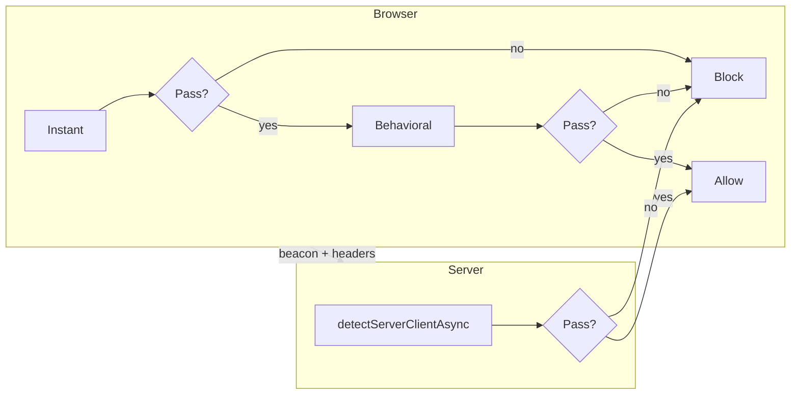

<div align="center">

# detect-bot-client

**Detect bots, headless browsers, and automation — in the browser and on the server.**

One library. Three layers of defense. Zero external API keys.

[](https://www.npmjs.com/package/detect-bot-client)
[](LICENSE)
[](https://nodejs.org)
[](https://github.com/okasi/detect-bot-client/actions/workflows/ci.yml)
[](https://github.com/okasi/detect-bot-client/actions/workflows/update-ip-data.yml)

[Quick start](#quick-start) · [Detection modes](#detection-modes) · [Signals](#signals) · [API](#api) · [Examples](#examples) · [FAQ](#faq)

</div>

---

## Why this library?

Most bot-detection snippets are copy-pasted checks that rot quickly. **detect-bot-client** gives you a maintained, typed, testable toolkit that covers the full stack:

**[Live demo](https://okasi.github.io/detect-bot-client/)** — run instant and behavioral checks in your browser.

| Layer | Runs where | Catches |
|-------|------------|---------|
| **Instant** | Browser (sync) | WebDriver, Selenium, Playwright, headless Chrome, bad WebGL/WebGPU |
| **Behavioral** | Browser (over time) | Robotic mouse/scroll/typing, synthetic events |
| **Server** | Node >= 22 | Datacenter IPs, AbuseIPDB, TLS fingerprint mismatch, timezone spoofing |

- **No API keys** — GeoIP and IP blocklists are bundled and updated weekly
- **TypeScript-first** — full types, ESM + CJS, `sideEffects: false`
- **Bundler-safe** — the root import resolves to a browser-only build in browser bundlers; explicit `/browser` and `/server` subpaths when you want to be precise
- **IPv4 + IPv6** — blocklist matching handles IPv6 ranges and IPv4-mapped addresses, all via binary search (~1µs per lookup)
- **Composable** — use one layer or combine all three
- **Explainable** — every flag has a name, weight, and confidence level
- **One dependency** — just the offline GeoIP database

---

## Quick start

```bash
npm install detect-bot-client
```

### Browser — block automation on page load

```ts
import { detectInstantClient } from "detect-bot-client";

const result = detectInstantClient(window);

if (!result.isLegitClient) {
  window.location.href = "/blocked";
}
```

### Server — score a request in one call

```ts
import { detectServerClientAsync } from "detect-bot-client";

const result = await detectServerClientAsync({
  clientIp: req.ip,
  clientTimezone: req.headers["x-timezone"],
  userAgent: req.headers["user-agent"],
  tlsFingerprint: req.headers["x-ja3-hash"],
});

if (!result.isLegitClient) {
  return res.status(403).json({ signals: result.signals });
}
```

### Behavioral — catch scripted interaction

```ts
import { createBehavioralClientDetector } from "detect-bot-client";

const result = await createBehavioralClientDetector({ context: window }).observe(10_000);

if (!result.isLegitClient) {
  console.warn("Robotic behavior", result.suspicionScore);
}
```

### Entry points

| Import | Contents | Runs in |
|--------|----------|---------|
| `detect-bot-client` | Everything (browser build in browser bundlers) | Browser + Node |
| `detect-bot-client/browser` | Instant + behavioral only | Browser |
| `detect-bot-client/server` | Server detection only | Node ≥ 22 |

No bundler? Load the global build from a CDN:

```html
<script src="https://unpkg.com/detect-bot-client"></script>
<script>
  const result = DetectBotClient.detectInstantClient(window);
</script>
```

---

## Detection modes



| Mode | API | Speed | Environment |
|------|-----|-------|-------------|
| **Instant** | `detectInstantClient` | Immediate | Browser |
| **Instant+** | `detectInstantClientAsync` | ~50ms | Browser (adds WebGPU check) |
| **Behavioral** | `createBehavioralClientDetector` | 5–30s | Browser |
| **Server** | `detectServerClientAsync` | ~1–5ms per IP | Node >= 22 |

### Instant

Runs synchronously against `window` and returns a weighted `suspicionScore`
(`1 - Π(1 - weight)` over triggered signals). Definitive automation markers
weigh 1.0 and block on their own; ambiguous checks that also fire on real
clients (in-app browsers, F11 fullscreen, GPU-less VMs) weigh 0.25–0.35 so they
only block in combination. `isLegitClient` is `suspicionScore < scoreThreshold`
(default 0.5) — tune it to taste. The async variant adds WebGPU `shader-f16`
validation on Chromium.

```ts
const result = detectInstantClient(window);
// result.suspicionScore, result.confidence, result.signals[], result.isLegitClient

// stricter: block on any single soft signal
const strict = detectInstantClient(window, { scoreThreshold: 0.3 });

const withWebGPU = await detectInstantClientAsync(window);
```

### Behavioral

Observes mouse, scroll, and keyboard events. Score: `1 - Π(1 - weight)` across triggered signals.

```ts
const detector = createBehavioralClientDetector({
  context: window,
  scoreThreshold: 0.55,
  onUpdate: (r) => console.log(r.suspicionScore),
});
await detector.observe(8_000);
```

### Server

Pass `clientIp` to auto-run GeoIP lookup, datacenter range check, AbuseIPDB blocklist, iCloud Private Relay check, TLS validation, and timezone comparison.

```ts
const result = await detectServerClientAsync({
  clientIp: req.ip,
  clientTimezone: req.headers["x-timezone"],
  tlsFingerprint: req.headers["x-ja3-hash"],
  userAgent: req.headers["user-agent"],
});
```

Bundled IP data is refreshed weekly. Run locally: `npm run update:ip-data`.

---

## Signals

### Instant (weighted)

Each check contributes its weight to `suspicionScore`; `isLegitClient` is
`suspicionScore < scoreThreshold` (default 0.5). Every boolean flag is still on
the result for inspection, alongside `signals[]` with per-check weights.

| Flag | Weight | Triggers when |
|------|--------|---------------|
| `isWebDriver` | 1.0 | `navigator.webdriver === true` |
| `isAutomationArtifacts` | 1.0 | ChromeDriver / Puppeteer / Playwright markers |
| `isSelenium` | 1.0 | Selenium document markers |
| `isPhantomJS` | 1.0 | PhantomJS globals present |
| `isNightmare` | 1.0 | Nightmare.js marker |
| `isDomAutomation` | 1.0 | Chrome DOM automation globals |
| `isHeadless` | 0.9 | WebDriver or HeadlessChrome UA |
| `isSuspiciousWebDriverDescriptor` | 0.9 | Patched/deleted `navigator.webdriver` |
| `isSuspiciousResolution` | 0.7 | Screen < 136×170 |
| `isUserAgentValid` | 0.7 | UA does not start with `Mozilla/5.0 (` |
| `isSoftwareRenderer` | 0.6 | SwiftShader / llvmpipe WebGL |
| `isMissingChromeObject` | 0.35 | Chromium without `window.chrome` (in-app browsers) |
| `isWebGLSupported` | 0.35 | No WebGL context (GPU-less VMs, headless Chromium 139+) |
| `isSuspiciousWindowDimensions` | 0.3 | No browser chrome + origin placement (F11 fullscreen) |
| `isModern` | 0.3 | Below Chrome 121 / Firefox 128 / Safari 16.4 |
| `isEmptyPlugins` | 0.25 | Zero plugins on **desktop** Chromium |
| `isShaderF16Supported` | 0.3 | Async — missing WebGPU `shader-f16` on Chromium |

The bottom group are soft signals: individually below the 0.5 threshold, they
flag but don't block, so common false-positive cases (in-app browsers, kiosk
fullscreen, VMs) pass unless they stack. `isEmptyPlugins` is skipped entirely on
mobile Chrome, which legitimately reports no plugins.

### Behavioral (weighted)

| ID | Weight | Confidence | Description |
|----|--------|------------|-------------|
| `no-mouse-activity` | 0.20 | low | Pointer clicks with zero mouse/touch events |
| `click-without-mouse-movement` | 0.35 | high | Click with no mouse or touch activity in the prior 2s |
| `linear-mouse-movement` | 0.25 | medium | Straight path, uniform speed |
| `teleport-mouse` | 0.40 | high | Implausible cursor jumps between closely-spaced events |
| `linear-scroll` | 0.30 | medium | Uniform scroll deltas/timing |
| `linear-typing` | 0.35 | high | Robotic or superhuman intervals (key auto-repeat excluded) |
| `synthetic-events` | 0.50 | high | `isTrusted === false` |

Touch taps, keyboard-activated clicks (`detail === 0`), and cursor re-entry
after leaving the window are recognized and never counted against the user.

### Server (weighted)

| ID | Weight | Confidence | Description |
|----|--------|------------|-------------|
| `timezone-mismatch` | 0.45 | high | Client TZ ≠ GeoIP TZ (sub-threshold: VPNs/travelers don't block alone) |
| `known-suspicious-tls` | 0.55 | high | JA3 matches Python/curl/Go/Java |
| `tls-user-agent-mismatch` | 0.50 | high | JA3 conflicts with User-Agent |
| `missing-tls-fingerprint` | 0.25 | medium | Browser UA without JA3 |
| `accept-language-geo-mismatch` | 0.20 | low | No acceptable Accept-Language country matches GeoIP (region-less, numeric-region, and q=0-only headers pass) |
| `datacenter-browser-mismatch` | 0.35 | medium | Datacenter IP + browser UA |
| `abuse-listed-ip` | 0.60 | high | AbuseIPDB 30-day blocklist |
| `icloud-private-relay` | 0.15 | low | iCloud Private Relay egress |

**Bundled IP data:** `data/datacenter_ip_ranges.csv` (ipcat), `data/abuse_ip_db_30d_ips.csv` (AbuseIPDB), `data/icloud_private_relay_ip_ranges.csv` (Apple, IPv4 + IPv6).

Lists are parsed once into sorted intervals (~0.5s, lazily on first `clientIp`
check); each lookup is then a binary search (~1µs). IPv4-mapped IPv6 input
(`::ffff:1.2.3.4`) normalizes to IPv4 before matching. Call `preloadIpLists()`
once at boot to move that one-off parse cost out of the first request.

> **IPv6 note:** the abuse and iCloud Relay lists cover IPv6, but the bundled
> GeoIP database and the ipcat datacenter list are IPv4-only — so
> `timezone-mismatch`, `accept-language-geo-mismatch`, and
> `datacenter-browser-mismatch` don't yet apply to IPv6 clients. Pass
> `ipTimezone`/`ipCountry`/`isDatacenterIp` yourself if you have an IPv6-capable
> source.

---

## API

```ts
// Browser (also available from the root import)
import {
  detectInstantClient,
  detectInstantClientAsync,
  buildInstantSignals,
  createBehavioralClientDetector,
  analyzeBehavioralSamples,
  isAutomationArtifacts,
  isSoftwareRenderer,
} from "detect-bot-client/browser";

// Server (also available from the root import in Node)
import {
  detectServerClient,
  detectServerClientAsync,
  enrichServerContext,
  lookupClientIpGeo,
  createIpListChecker,
  preloadIpLists,
  parseIp,
  isTimezoneMismatch,
  isTlsUserAgentMismatch,
  isValidJa3Hash,
  KNOWN_SUSPICIOUS_TLS_FINGERPRINTS,
} from "detect-bot-client/server";
```

### Server options

```ts
detectServerClientAsync(context, {
  dataDir: "./custom-data",
  lookupGeo: true,
  checkIpLists: true,
  timezoneToleranceMinutes: 60,
  scoreThreshold: 0.5,
  requireTlsFingerprint: false,
  suspiciousTlsFingerprints: [],
});
```

### Behavioral options

```ts
createBehavioralClientDetector({
  context: window,
  minObservationMs: 3_000,
  scoreThreshold: 0.55,
  pollIntervalMs: 1_000,
  sampleWindowMs: 60_000, // retain only recent samples (Infinity = keep all)
  onUpdate: (result) => {},
});
```

A long-lived detector (`start()` without `stop()`) keeps only the last
`sampleWindowMs` of events, so memory stays bounded. `observe()` rejects if an
observation is already in progress.

---

## Examples

### Defense in depth

```ts
const instant = detectInstantClient(window);
if (!instant.isLegitClient) block();

fetch("/api/beacon", {
  headers: { "X-Timezone": Intl.DateTimeFormat().resolvedOptions().timeZone },
});

const behavioral = await createBehavioralClientDetector({ context: window }).observe(10_000);
if (!behavioral.isLegitClient) challenge();

const server = await detectServerClientAsync({ clientIp: req.ip /* ... */ });
if (!server.isLegitClient) return res.status(403).end();
```

### Express middleware

```ts
import { detectServerClientAsync } from "detect-bot-client";

app.use(async (req, res, next) => {
  const result = await detectServerClientAsync({
    clientIp: req.ip,
    clientTimezone: req.headers["x-timezone"],
    userAgent: req.headers["user-agent"],
    tlsFingerprint: req.headers["x-ja3-hash"],
  });

  if (!result.isLegitClient) {
    return res.status(403).json({ signals: result.signals });
  }
  next();
});
```

### Next.js client guard

```tsx
"use client";
import { useEffect } from "react";
import { detectInstantClient } from "detect-bot-client";

export function BotGuard({ children }) {
  useEffect(() => {
    if (!detectInstantClient(window).isLegitClient) {
      window.location.href = "/blocked";
    }
  }, []);
  return children;
}
```

---

## FAQ

**Can client-side checks be bypassed?**  
Yes. Use instant + behavioral for friction; server detection for authoritative decisions.

**False positives?**  
Every layer is weighted, so ambiguous single signals (in-app browsers, F11
fullscreen, GPU-less VMs, VPN timezone mismatches) flag but don't block on their
own — they only cross the threshold in combination. Tune `scoreThreshold` per
layer to trade friction for coverage.

**How often is IP data updated?**
Weekly (Mondays 04:00 UTC). Run `npm run update:ip-data` locally anytime.

**Works without bundlers?**
Yes — ESM + CJS + types, plus a global IIFE build on unpkg/jsdelivr (`DetectBotClient.*`).

**Why does headless Chrome fail the WebGL check?**
Chromium 139+ removed the software WebGL fallback, so GPU-less headless
sessions expose no WebGL at all — which is exactly what `isWebGLSupported`
flags. Real desktop browsers with working GPUs pass.

---

## Development

```bash
git clone https://github.com/okasi/detect-bot-client.git
cd detect-bot-client
npm install
npx patchright install chromium   # once, for browser tests
npm test                          # unit tests
npm run test:coverage             # unit tests + 100% coverage gate
npm run test:patchright           # real Chromium via patchright
npm run build
npm run lint:package              # publint + Are The Types Wrong
npm run check                     # typecheck + coverage + patchright + build + package lint
npm run build:site                # generate the GitHub Pages artifact in .pages/
```

Live demo: https://okasi.github.io/detect-bot-client/ (deployed from `.pages/` on push to `main`).

**GitHub Pages setup (one time):** Settings → Pages → Build and deployment → **GitHub Actions**.

### Publish to npm

npm package: **`detect-bot-client`** (verified available; distinct from older [`detect-bot`](https://www.npmjs.com/package/detect-bot)).

#### Step 1 — First publish (once, from your computer)

```bash
git clone https://github.com/okasi/detect-bot-client.git
cd detect-bot-client
npm install
npm run check
npm login
npm publish --access public
```

#### Step 2 — Enable Trusted Publishing (for GitHub Actions)

1. https://www.npmjs.com/package/detect-bot-client → **Settings** → **Trusted publishing**
2. **GitHub Actions** → user `okasi`, repo `detect-bot-client`, workflow `publish.yml`
3. Save

#### Step 3 — Future releases via Actions

```bash
npm version patch
git push origin main --follow-tags
```

Or re-run **Actions → Publish npm → Run workflow**.

See [CONTRIBUTING.md](CONTRIBUTING.md) for local development and pull request checks,
[SECURITY.md](SECURITY.md) for private vulnerability reporting, and [AGENTS.md](AGENTS.md)
for architecture guidance.

## License

[MIT](LICENSE) © [okasi](https://github.com/okasi)

---

<div align="center">

**If this saved you time, consider starring the repo.**

[](https://github.com/okasi/detect-bot-client)

</div>
