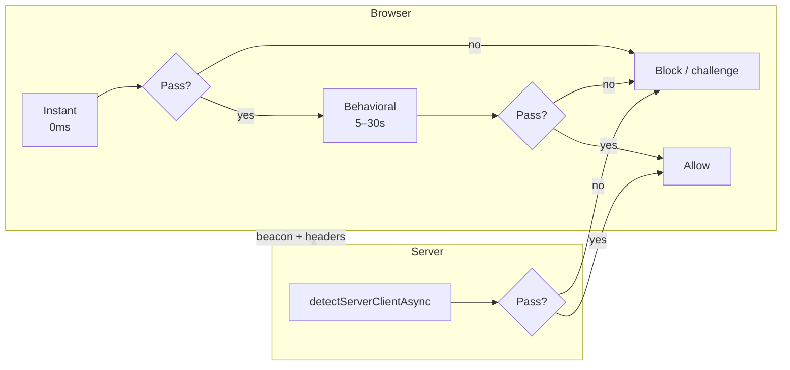

<div align="center">

# is-suspicious-client

**Detect bots, headless browsers, and automation — in the browser and on the server.**

One library. Three layers of defense. Zero external API keys.

[](https://www.npmjs.com/package/is-suspicious-client)
[](LICENSE)
[](https://nodejs.org)
[](https://github.com/okasi/is-suspicious-client/actions/workflows/ci.yml)
[](https://github.com/okasi/is-suspicious-client/actions/workflows/update-ip-data.yml)

[Quick start](#quick-start) · [Detection modes](#detection-modes) · [Examples](#examples) · [API](docs/API.md) · [Integration guides](docs/INTEGRATION.md) · [All signals](docs/SIGNALS.md)

</div>

---

## Why this library?

Most bot-detection snippets are copy-pasted checks that rot quickly. **is-suspicious-client** gives you a maintained, typed, testable toolkit that covers the full stack:

| Layer | Runs where | Catches |
|-------|------------|---------|
| **Instant** | Browser (sync) | WebDriver, Selenium, Playwright, headless Chrome, bad WebGL/WebGPU |
| **Behavioral** | Browser (over time) | Robotic mouse/scroll/typing, synthetic events |
| **Server** | Node / edge | Datacenter IPs, AbuseIPDB, TLS fingerprint mismatch, timezone spoofing |

- **No API keys** — GeoIP and IP blocklists are bundled and updated weekly
- **TypeScript-first** — full types, ESM + CJS
- **Composable** — use one layer or combine all three
- **Explainable** — every flag has a name, weight, and confidence level

---

## Quick start

```bash
npm install is-suspicious-client
```

### Browser — block automation on page load

```ts
import { detectInstantClient } from "is-suspicious-client";

const result = detectInstantClient(window);

if (!result.isLegitClient) {
  // WebDriver, Selenium, headless signals, etc.
  window.location.href = "/blocked";
}
```

### Server — score a request in one call

```ts
import { detectServerClientAsync } from "is-suspicious-client";

const result = await detectServerClientAsync({
  clientIp: req.ip,
  clientTimezone: req.headers["x-timezone"],
  userAgent: req.headers["user-agent"],
  tlsFingerprint: req.headers["x-ja3-hash"],
});

if (!result.isLegitClient) {
  return res.status(403).json({ signals: result.signals });
}
```

### Behavioral — catch scripted interaction

```ts
import { createBehavioralClientDetector } from "is-suspicious-client";

const detector = createBehavioralClientDetector({ context: window });
const result = await detector.observe(10_000);

if (!result.isLegitClient) {
  console.warn("Robotic behavior", result.suspicionScore);
}
```

---

## Detection modes



| Mode | API | Speed | Environment |
|------|-----|-------|-------------|
| **Instant** | `detectInstantClient` | Immediate | Browser |
| **Instant+** | `detectInstantClientAsync` | ~50ms | Browser (adds WebGPU check) |
| **Behavioral** | `createBehavioralClientDetector` | 5–30s observation | Browser |
| **Server** | `detectServerClientAsync` | ~1–5ms per IP | Node, Deno, edge |

<details>
<summary><strong>Instant detection</strong> — 17 environment checks</summary>

Runs synchronously against `window`. Ideal for first-pass gating.

```ts
import { detectInstantClient, detectInstantClientAsync } from "is-suspicious-client";

// Sync — use on page load
const sync = detectInstantClient(window);

// Async — adds WebGPU shader-f16 validation on Chromium
const async = await detectInstantClientAsync(window);
```

**Highlights:** `navigator.webdriver`, Selenium/Playwright artifacts, SwiftShader WebGL, missing `chrome.runtime`, suspicious window dimensions, patched webdriver descriptor, and more.

→ [Full instant signal list](docs/SIGNALS.md#instant-signals)

</details>

<details>
<summary><strong>Behavioral detection</strong> — weighted interaction scoring</summary>

Observes mouse, scroll, and keyboard events. Produces a **suspicion score** (0–1) using `1 - Π(1 - weight)` across triggered signals.

```ts
const detector = createBehavioralClientDetector({
  context: window,
  scoreThreshold: 0.55,
  onUpdate: (r) => console.log(r.suspicionScore),
});

await detector.observe(8_000);
```

**Catches:** linear mouse paths, cursor teleports, clicks without movement, robotic typing intervals, `isTrusted === false` events.

→ [Full behavioral signal list](docs/SIGNALS.md#behavioral-signals)

</details>

<details>
<summary><strong>Server detection</strong> — IP, TLS, timezone, blocklists</summary>

Pass `clientIp` and the library automatically:

1. Looks up **country + timezone** via [`doc999tor-fast-geoip`](https://www.npmjs.com/package/doc999tor-fast-geoip)
2. Checks **datacenter ranges** ([ipcat](https://github.com/client9/ipcat) — AWS, OVH, Hetzner, …)
3. Matches **AbuseIPDB** 30-day blocklist (~139k IPs, all countries)
4. Checks **iCloud Private Relay** egress ranges (~287k CIDRs, all countries)
5. Validates **TLS fingerprint** vs User-Agent (JA3 blocklist for Python, curl, Go, …)
6. Compares **client timezone** vs GeoIP timezone

```ts
const result = await detectServerClientAsync({
  clientIp: "203.0.113.1",
  clientTimezone: "Europe/Berlin",
  tlsFingerprint: "e7d705a3286e19ea42f587b344ee6865",
  userAgent: req.headers["user-agent"],
});
```

**Bundled data** is refreshed weekly by GitHub Actions. Run locally: `npm run update:ip-data`.

→ [Full server signal list](docs/SIGNALS.md#server-signals) · [Integration guides](docs/INTEGRATION.md)

</details>

---

## Recommended defense-in-depth

```ts
// 1. Browser: instant gate on load
const instant = detectInstantClient(window);
if (!instant.isLegitClient) block();

// 2. Browser: send timezone beacon for server checks
fetch("/api/beacon", {
  method: "POST",
  headers: { "X-Timezone": Intl.DateTimeFormat().resolvedOptions().timeZone },
});

// 3. Browser: behavioral check while user interacts
const behavioral = await createBehavioralClientDetector({ context: window }).observe(10_000);
if (!behavioral.isLegitClient) challenge();

// 4. Server: validate every API request
const server = await detectServerClientAsync({ clientIp: req.ip, /* ... */ });
if (!server.isLegitClient) return res.status(403).end();
```

> **Tip:** No single layer is bulletproof. Combine instant + server for best coverage; add behavioral for high-value flows (signup, checkout).

---

## Examples

### Express middleware

```ts
import { detectServerClientAsync } from "is-suspicious-client";

export async function botGuard(req, res, next) {
  const result = await detectServerClientAsync({
    clientIp: req.ip,
    clientTimezone: req.headers["x-timezone"],
    userAgent: req.headers["user-agent"],
    acceptLanguage: req.headers["accept-language"],
    tlsFingerprint: req.headers["x-ja3-hash"],
  });

  if (!result.isLegitClient) {
    return res.status(403).json({ error: "suspicious_client", signals: result.signals });
  }

  next();
}
```

### Next.js App Router

```tsx
// app/layout.tsx
"use client";
import { useEffect } from "react";
import { detectInstantClient } from "is-suspicious-client";

export default function RootLayout({ children }) {
  useEffect(() => {
    if (!detectInstantClient(window).isLegitClient) {
      window.location.href = "/blocked";
    }
  }, []);

  return <html><body>{children}</body></html>;
}
```

### Vanilla browser + server beacon

```html
<script type="module">
  import { detectInstantClient } from "https://esm.sh/is-suspicious-client";

  if (!detectInstantClient(window).isLegitClient) {
    document.body.innerHTML = "Access denied.";
  }

  // Help server-side timezone check
  fetch("/api/beacon", {
    headers: {
      "X-Timezone": Intl.DateTimeFormat().resolvedOptions().timeZone,
    },
  });
</script>
```

More examples: [docs/INTEGRATION.md](docs/INTEGRATION.md)

---

## API at a glance

```ts
import {
  // Browser — instant
  detectInstantClient,
  detectInstantClientAsync,

  // Browser — behavioral
  createBehavioralClientDetector,
  analyzeBehavioralSamples,

  // Server
  detectServerClient,
  detectServerClientAsync,
  enrichServerContext,
  lookupClientIpGeo,
  createIpListChecker,

  // Standalone checks
  isAutomationArtifacts,
  isSoftwareRenderer,
  isTimezoneMismatch,
  isTlsUserAgentMismatch,
  KNOWN_SUSPICIOUS_TLS_FINGERPRINTS,
} from "is-suspicious-client";
```

Full reference: **[docs/API.md](docs/API.md)**

---

## Configuration

### Server options

```ts
detectServerClientAsync(context, {
  dataDir: "./custom-data",       // override bundled blocklists
  lookupGeo: true,                // doc999tor-fast-geoip lookup
  checkIpLists: true,             // abuse / datacenter / icloud lists
  timezoneToleranceMinutes: 60,   // IP vs client TZ offset tolerance
  scoreThreshold: 0.5,            // below = isLegitClient
  requireTlsFingerprint: false,   // flag browser UA without JA3
  suspiciousTlsFingerprints: [],  // custom JA3 hashes
});
```

### Behavioral options

```ts
createBehavioralClientDetector({
  context: window,
  minObservationMs: 3_000,
  scoreThreshold: 0.55,
  pollIntervalMs: 1_000,
  onUpdate: (result) => { /* live score */ },
});
```

---

## FAQ

<details>
<summary><strong>Can client-side checks be bypassed?</strong></summary>

Yes — anything in JavaScript can be patched. Use **instant + behavioral** for UX gating and friction, and **server detection** for authoritative decisions. Never rely on client-side alone for security-critical actions.
</details>

<details>
<summary><strong>What about false positives?</strong></summary>

Possible on: privacy browsers (Brave, Firefox RFP), VPN users, iCloud Private Relay, corporate proxies, VMs with software rendering, and fresh browser profiles with no plugins. Tune `scoreThreshold` and treat signals as risk scores, not hard blocks.
</details>

<details>
<summary><strong>How often is IP data updated?</strong></summary>

Weekly via GitHub Actions (Mondays 04:00 UTC). Lists: AbuseIPDB 30-day, iCloud Private Relay egress, ipcat datacenter ranges. Run `npm run update:ip-data` locally anytime.
</details>

<details>
<summary><strong>Does it work without bundlers?</strong></summary>

Yes. Published as ESM + CJS with TypeScript types. Use with Vite, Webpack, Next.js, or `esm.sh` in the browser.
</details>

<details>
<summary><strong>What happened to <code>detectSuspiciousClient</code>?</strong></summary>

It's still exported as a deprecated alias for `detectInstantClient`.
</details>

---

## Development

```bash
git clone https://github.com/okasi/is-suspicious-client.git
cd is-suspicious-client
npm install
npm test              # 39 tests
npm run build
npm run update:ip-data  # refresh blocklists
```

See [CONTRIBUTING.md](CONTRIBUTING.md) and [CHANGELOG.md](CHANGELOG.md).

---

## License

[MIT](LICENSE) © [okasi](https://github.com/okasi)

---

<div align="center">

**If this saved you time, consider starring the repo — it helps others find it.**

[](https://github.com/okasi/is-suspicious-client)

</div>
