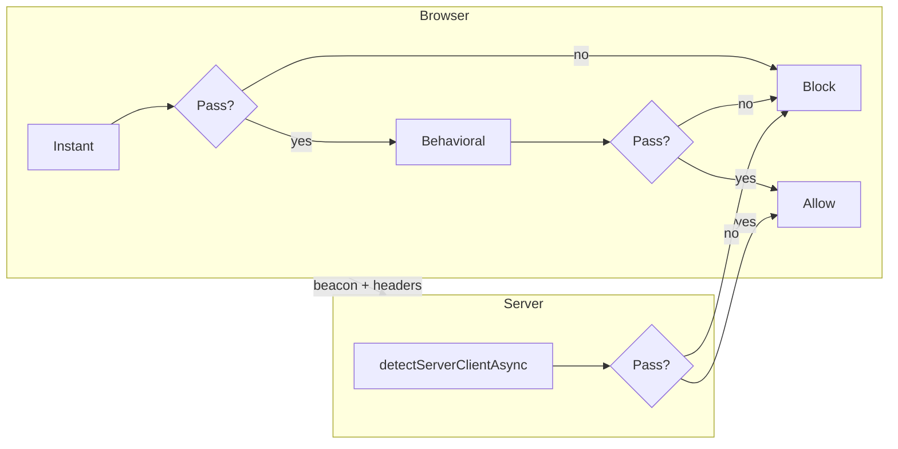

<div align="center">


# bot-signal

**bot-signal** — bot signal detection in the browser and on the server.

Provides a simple `isHuman()` function plus full multi-layer signals (instant browser checks, behavioral analysis, and server-side IP/TLS/timezone validation). Zero external API keys.

[](https://www.npmjs.com/package/bot-signal)
[](LICENSE)
[](https://nodejs.org)
[](https://github.com/okasi/bot-signal/actions/workflows/ci.yml)
[](https://github.com/okasi/bot-signal/actions/workflows/update-ip-data.yml)

[Quick start](#quick-start) · [Detection modes](#detection-modes) · [Signals](#signals) · [API](#api) · [Examples](#examples) · [FAQ](#faq)

</div>

---

## Why bot-signal?

Most bot-detection snippets are copy-pasted checks that rot quickly. The `bot-signal` package gives you a maintained, typed, testable toolkit that covers the full stack:

**[Live demo](https://okasi.github.io/bot-signal/)** — run instant and behavioral checks in your browser.

| Layer | Runs where | Catches |
|-------|------------|---------|
| **Instant** | Browser (sync/async) | Automation artifacts, native tampering, realm/UA/GPU inconsistencies, CDP |
| **Behavioral** | Browser (over time) | Robotic mouse/scroll/typing, synthetic events |
| **Server** | Node >= 22 | Datacenter IPs, AbuseIPDB, TLS fingerprint mismatch, timezone spoofing |

- **No API keys** — GeoIP and IP blocklists are bundled and updated weekly (note: the full package is ~1.8 MB tarball / ~16 MB unpacked primarily due to the blocklist data)
- **TypeScript-first** — full types, ESM + CJS, `sideEffects: false`
- **Bundler-safe** — the root import resolves to a browser-only build in browser bundlers; explicit `/browser` and `/server` subpaths when you want to be precise
- **IPv4 + IPv6** — blocklist matching handles IPv6 ranges and IPv4-mapped addresses, all via binary search (~1µs per lookup)
- **Composable** — use one layer or combine all three
- **Explainable** — every flag has a name, weight, and confidence level
- **One dependency** — just the offline GeoIP database

---

## Quick start

```bash
npm install bot-signal
```

### Browser — block automation on page load

```ts
import { isHuman } from "bot-signal";

if (!isHuman(window)) {
  window.location.href = "/blocked";
}
```

### Server — score a request in one call

```ts
import { detectServerClientAsync } from "bot-signal";

const result = await detectServerClientAsync({
  clientIp: req.ip,
  clientTimezone: req.headers["x-timezone"],
  userAgent: req.headers["user-agent"],
  tlsFingerprint: req.headers["x-ja3-hash"],
});

if (!result.isLegitClient) {
  return res.status(403).json({ signals: result.signals });
}
```

### Behavioral — catch scripted interaction

```ts
import { createBehavioralClientDetector } from "bot-signal";

const result = await createBehavioralClientDetector({ context: window }).observe(10_000);

if (!result.isLegitClient) {
  console.warn("Robotic behavior", result.suspicionScore);
}
```

### Entry points

| Import | Contents | Runs in |
|--------|----------|---------|
| `bot-signal` | Everything (browser build in browser bundlers) + `isHuman()` | Browser + Node |
| `bot-signal/browser` | Instant + behavioral only | Browser |
| `bot-signal/server` | Server detection only | Node ≥ 22 |

No bundler? Load the global build from a CDN:

```html
<script src="https://unpkg.com/bot-signal"></script>
<script>
  // The global is `BotSignal` (the package name is `bot-signal`)
  if (!BotSignal.isHuman(window)) {
    location.href = "/blocked";
  }
</script>
```

---

## Detection modes


```mermaid
flowchart LR
  subgraph Browser
    A[Instant] --> B{Pass?}
    B -->|yes| C[Behavioral]
    B -->|no| X[Block]
    C --> D{Pass?}
    D -->|yes| E[Allow]
    D -->|no| X
  end
  subgraph Server
    S[detectServerClientAsync] --> T{Pass?}
    T -->|yes| E
    T -->|no| X
  end
  Browser -->|beacon + headers| Server
```

| Mode | API | Speed | Environment |
|------|-----|-------|-------------|
| **Instant** | `isHuman` (or `detectInstantClient`) | Immediate | Browser |
| **Instant+** | `isHumanAsync` (or `detectInstantClientAsync`) | Usually <500ms | Browser (adds WebGPU, CDP, permissions, high-entropy UA-CH, worker checks) |
| **Behavioral** | `createBehavioralClientDetector` | 5–30s | Browser |
| **Server** | `detectServerClientAsync` | ~1–5ms per IP | Node >= 22 |

### Instant

`bot-signal`'s instant mode runs synchronously against `window` and returns a weighted `suspicionScore`
(`1 - Π(1 - weight)` over triggered signals). Definitive automation markers
weigh 1.0 and block on their own; ambiguous checks that also fire on real
clients (in-app browsers, F11 fullscreen, GPU-less VMs) weigh 0.25–0.45 so they
only block in combination. `isLegitClient` is `suspicionScore < scoreThreshold`
(default 0.5) — tune it to taste. The async variant adds WebGPU `shader-f16`,
CDP serialization, Notification/Permissions consistency, high-entropy Client
Hints, and worker-realm validation.

```ts
if (!isHuman(window)) {
  // block
}

// full result if you need details
const result = detectInstantClient(window);
// result.suspicionScore, result.confidence, result.signals[], result.isLegitClient
// result.automation.kind, .confidence, .evidence, .alternatives

// stricter: block on any single soft signal
const strict = detectInstantClient(window, { scoreThreshold: 0.3 });

const withWebGpu = await isHumanAsync(window); // or detectInstantClientAsync
```

### Behavioral

`bot-signal`'s behavioral mode observes mouse, scroll, and keyboard events. Score: `1 - Π(1 - weight)` across triggered signals.

```ts
const detector = createBehavioralClientDetector({
  context: window,
  scoreThreshold: 0.55,
  onUpdate: (r) => console.log(r.suspicionScore),
});
await detector.observe(8_000);
```

### Server

`bot-signal`'s server mode passes `clientIp` to auto-run GeoIP lookup, datacenter range check, AbuseIPDB blocklist, iCloud Private Relay check, TLS validation, and timezone comparison.

```ts
const result = await detectServerClientAsync({
  clientIp: req.ip,
  clientTimezone: req.headers["x-timezone"],
  tlsFingerprint: req.headers["x-ja3-hash"],
  userAgent: req.headers["user-agent"],
  clientUserAgent: req.body.browser?.userAgent,
  clientLanguage: req.body.browser?.language,
  clientLanguages: req.body.browser?.languages,
  clientPlatform: req.body.browser?.platform,
  secChUa: req.headers["sec-ch-ua"],
  secChUaPlatform: req.headers["sec-ch-ua-platform"],
  secChUaMobile: req.headers["sec-ch-ua-mobile"],
  secFetchSite: req.headers["sec-fetch-site"],
  secFetchMode: req.headers["sec-fetch-mode"],
  secFetchDest: req.headers["sec-fetch-dest"],
});
```

`tlsFingerprint` must come from infrastructure that actually terminated the
TLS connection (for example, trusted reverse-proxy metadata). Strip any
client-supplied fingerprint header at the edge before adding the trusted value;
an arbitrary request header is attacker-controlled and is not JA3/JA4 evidence.
No client-family TLS hashes are bundled because fingerprints vary by TLS stack
and version and do not prove the calling library. Use
`suspiciousTlsFingerprints` for reputation-only JA3/JA4 values, or
`suspiciousTlsFingerprintEntries` with a trusted `families` label when you also
want TLS/User-Agent consistency and attribution corroboration.

Both instant and server results include an `automation` assessment. When
page-realm artifacts are exposed they can identify `playwright`, `puppeteer`,
`selenium`, `phantomjs`, or `nightmare`. A scripting-client User-Agent can
suggest `curl`, `python`, `go`, or `java`; explicit UA products can identify a
`browser-automation`, `playwright`, `puppeteer`, `selenium`, or `phantomjs`
family. Crawler and generic HTTP-client UAs use `kind: "unknown"` with explicit
evidence to preserve the package's closed attribution union. TLS fingerprints only add risk or
corroborating evidence and never identify a family alone. When fingerprints
overlap, the result uses `browser-automation` plus `alternatives`. Patchright
can appear as an
alternative when a Chromium automation pattern is present, but generic
environment anomalies never identify Patchright on their own.
`automation.isAutomated` records evidence independently of the
configured enforcement threshold; `isLegitClient` remains the policy verdict.
An automation `kind` of `unknown` means no supported client-family kind was
selected, not that the request was proven human; inspect `evidence` and
`signals` for crawler, HTTP-client, or generic bot attribution.
This is intentionally probabilistic: a page cannot prove which Node/Python
package controls a browser after all brand-specific artifacts are removed.
Server reputation/geo signals can make `isLegitClient` false without setting
`automation.isAutomated`; a risky IP is not automatically a browser bot.

Bundled IP data is refreshed weekly. Run locally: `npm run update:ip-data`.

---

## Signals

### Instant (weighted)

Each check contributes its weight to `suspicionScore`; `isLegitClient` is
`suspicionScore < scoreThreshold` (default 0.5). Every boolean flag is still on
the result for inspection, alongside `signals[]` with per-check weights.
Distinctive Playwright, Puppeteer, and ChromeDriver artifacts block on their
own. Generic legacy or embedded-runtime markers stay soft because ordinary
applications can reuse those global names.

| Flag | Weight | Triggers when |
|------|--------|---------------|
| `isWebDriver` | 1.0 | `navigator.webdriver === true` |
| `isPlaywright` | 1.0 | Playwright bindings, init scripts, or exposed-function source markers |
| `isPuppeteer` | 1.0 | Puppeteer bindings, evaluation artifacts, or `puppeteer_*` functions |
| `isChromeDriver` | 1.0 | Distinctive ChromeDriver or WebDriver cache artifacts |
| `isAutomationArtifacts` | 0.35 | Umbrella for framework, legacy automation, exposed-function, embedded-runtime, or document-attribute markers |
| `isSelenium` | 1.0 | Selenium document markers |
| `isPhantomJS` | 1.0 | PhantomJS-specific `callPhantom` or `_phantom` global present |
| `isNightmare` | 1.0 | Nightmare.js marker |
| `isDomAutomation` | 1.0 | Chrome DOM automation globals |
| `isHeadless` | 0.9 | WebDriver, or a HeadlessChrome UA / appVersion / Client Hints brand |
| `isSuspiciousWebDriverDescriptor` | 0.9 | Patched/deleted `navigator.webdriver` |
| `isSuspiciousResolution` | 0.7 | Screen < 136×170 |
| `isUserAgentValid` | 0.7 | UA is malformed or contains a known bot, scripting, or automation token |
| `isSoftwareRenderer` | 0.6 | SwiftShader / llvmpipe WebGL |
| `isUserAgentDataMismatch` | 0.65 | UA version/mobile/platform conflicts with Client Hints |
| `isNativeFunctionTampered` | 0.8 | Native functions or Navigator getters were patched |
| `isNavigatorIdentityInconsistent` | 0.65 | UA conflicts with Navigator vendor/platform/product/touch claims |
| `isPluginArrayInconsistent` | 0.65 | Plugin/MIME arrays or entries have non-native prototypes |
| `isIframeInconsistent` | 0.8 | Shared realm objects, injected `self.get`, `webdriver` drift, or a fresh iframe describing a different OS/browser than the page |
| `isErrorStackAutomation` | 0.85 | Error stack contains an automation source marker |
| `isEngineInconsistent` | 0.8 | `eval.toString().length` (33 in V8, 37 in SpiderMonkey/JSC) or SpiderMonkey-only globals contradict the browser the UA claims |
| `isGpuPlatformMismatch` | 0.6 | WebGL renderer names Direct3D off Windows, Metal off Apple, or Adreno/Mali off Android |
| `isMediaQueryInconsistent` | 0.5 | The CSS `resolution` query contradicts `devicePixelRatio` (2% tolerance for zoom and fractional scaling) |
| `isLanguageInconsistent` | 0.45 | `language` disagrees with `languages[0]` |
| `isPluginMimeTypeInconsistent` | 0.45 | Plugins and MIME types were patched inconsistently |
| `isScreenGeometryInconsistent` | 0.45 | `availWidth`/`availHeight` exceed the screen, or an impossible colour depth |
| `isMissingProprietaryCodecs` | 0.4 | Chromium build with no H.264 (unbranded automation image, not Google Chrome) |
| `isMissingChromeObject` | 0.35 | Chromium without `window.chrome` (in-app browsers) |
| `isWebGLSupported` | 0.35 | No WebGL context (GPU-less VMs, headless Chromium 139+) |
| `isSuspiciousWindowDimensions` | 0.3 | Zero outer size, or no browser chrome + origin placement (F11 fullscreen) |
| `isModern` | 0.3 | Below Chrome 121 / Firefox 128 / Safari 16.4 |
| `isEmptyPlugins` | 0.25 | Zero plugins on **desktop** Chromium |
| `isSuspiciousHardware` | 0.3 | `deviceMemory` off the power-of-two grid, or an impossible CPU count |
| `isZeroConnectionRtt` | 0.2 | Zero Network Information RTT outside Android |
| `isDefaultAutomationViewport` | 0.2 | 800×600 or 1280×720 screen/viewport default |
| `isCanvasTampered` | 0.2 | Deterministic canvas pixel moves more than ±8 per channel on readback |
| `isShaderF16Supported` | 0.3 | Async — missing WebGPU `shader-f16` on Chromium |
| `isCdpDetected` | 0.25 | Async — CDP serialized an `Error` object (deduplicated with worker CDP) |
| `isNotificationPermissionInconsistent` | 0.55 | Async — Notification and Permissions states contradict |
| `isHighEntropyUserAgentDataMismatch` | 0.65 | Async — high-entropy UA-CH conflicts with the UA |
| `isWorkerInconsistent` | 0.8 | Async — the worker realm describes a different OS family or browser major version than the page |
| `isCdpDetectedInWorker` | 0.25 | Async — CDP serialized an `Error` in a worker (deduplicated with page CDP) |
| `isMissingMediaDevices` | 0.3 | Async — desktop Chromium enumerated no audio or video devices |

**Browser fingerprint protection is not automation.** The two cross-realm
checks (`isIframeInconsistent`, `isWorkerInconsistent`) compare what the realms
*mean*, not their strings. Protection rewrites values per realm by design —
Opera 133 reports 2 cores and a normalised locale to the page while its workers
and `about:blank` frames report the machine's real 10 — so byte equality flags
stock browsers. A realm mismatch is only counted when the realms describe a
different **OS family**, a different **browser major version**, or when two
softer values (primary language subtag, platform/UA string) disagree together.
`navigator.hardwareConcurrency` is not compared at all. Realm-identity tampering
and `navigator.webdriver` drift still fire on their own, and a missing
`window.chrome` inside a fresh frame is ignored entirely because Chromium forks
and Electron do that legitimately.

For the same reason `isMediaQueryInconsistent` compares only `resolution`
against `devicePixelRatio` — Opera reports `screen.colorDepth` 24 on a 10-bit
display, so no mapping onto the CSS `color` query survives contact with a stock
browser — and `isCanvasTampered` allows ±8 per channel, clearing both
colour-managed readback and injected per-origin noise.

Signals weighted below the 0.5 threshold are soft: individually they flag but
don't block, so common false-positive cases (in-app browsers, kiosk fullscreen,
VMs) pass unless they stack. `isEmptyPlugins` is skipped entirely on mobile
Chrome, which legitimately reports no plugins. The Chromium-only CDP probes
use medium confidence and contribute at most one 0.25 signal when either or
both trigger, because an open DevTools session can also serialize the
diagnostic objects.

### Behavioral (weighted)

| ID | Weight | Confidence | Description |
|----|--------|------------|-------------|
| `no-mouse-activity` | 0.20 | low | Pointer clicks with zero mouse/touch events |
| `click-without-mouse-movement` | 0.35 | high | Click with no mouse or touch activity in the prior 2s |
| `linear-mouse-movement` | 0.25 | medium | Straight path, uniform speed |
| `zero-mouse-movement-deltas` | 0.30 | medium | More than 50 mouse events all report zero `movementX`/`movementY` |
| `teleport-mouse` | 0.40 | high | Implausible cursor jumps between closely-spaced events |
| `linear-scroll` | 0.30 | medium | Uniform scroll deltas/timing |
| `linear-typing` | 0.35 | high | Robotic or superhuman intervals (key auto-repeat excluded) |
| `synthetic-events` | 0.50 | high | `isTrusted === false` |

Touch taps, keyboard-activated clicks (`detail === 0`), and cursor re-entry
after leaving the window are recognized and never counted against the user.

The exact numeric thresholds inside the heuristics (linearity CV cutoffs,
distance/time teleport rules, etc.) are tuned constants. They are not
currently exposed as options in order to keep the public API small and
predictable. See source for the documented constants if you need to fork
the logic.

### Server (weighted)

| ID | Weight | Confidence | Description |
|----|--------|------------|-------------|
| `scripting-user-agent` | 0.75 | medium | UA claims curl/Python/Go/Java |
| `bot-user-agent` | 0.90 | high | UA claims a conservative known bot, HTTP-client, or automation product token |
| `client-hints-mismatch` | 0.65 | high | Chromium UA version conflicts with `sec-ch-ua` |
| `client-user-agent-mismatch` | 0.80 | high | HTTP UA conflicts with `navigator.userAgent` from a client beacon |
| `client-language-mismatch` | 0.45 | medium | Accept-Language conflicts with Navigator languages |
| `client-platform-mismatch` | 0.55 | high | UA OS conflicts with Navigator or UA-CH platform |
| `client-hints-mobile-mismatch` | 0.55 | high | `sec-ch-ua-mobile` conflicts with the UA |
| `missing-browser-headers` | 0.35 | medium | Browser UA lacks Fetch Metadata headers (opt-in) |
| `timezone-mismatch` | 0.45 | high | Client TZ ≠ GeoIP TZ (sub-threshold: VPNs/travelers don't block alone) |
| `known-suspicious-tls` | 0.55 | high / entry confidence | JA3/JA4 matches a caller-supplied suspicious value |
| `tls-user-agent-mismatch` | 0.50 | entry confidence | JA3/JA4 family conflicts with User-Agent |
| `missing-tls-fingerprint` | 0.25 | medium | Browser UA without a TLS fingerprint |
| `accept-language-geo-mismatch` | 0.20 | low | No acceptable Accept-Language country matches GeoIP (region-less, numeric-region, and q=0-only headers pass) |
| `datacenter-browser-mismatch` | 0.35 | medium | Datacenter IP + browser UA |
| `abuse-listed-ip` | 0.60 | high | AbuseIPDB 30-day blocklist |
| `icloud-private-relay` | 0.15 | low | iCloud Private Relay egress |

**Bundled IP data:** `data/datacenter_ip_ranges.csv` (ipcat), `data/abuse_ip_db_30d_ips.csv` (AbuseIPDB), `data/icloud_private_relay_ip_ranges.csv` (Apple, IPv4 + IPv6).

Lists are parsed once into sorted intervals (~0.5s, lazily on first `clientIp`
check); each lookup is then a binary search (~1µs). IPv4-mapped IPv6 input
(`::ffff:1.2.3.4`) normalizes to IPv4 before matching. Call `preloadIpLists()`
once at boot to move that one-off parse cost out of the first request.

> **Note on caching:** `getIpListChecker` uses a module-level cache. In
> environments that load both ESM and CJS versions of the package you may
> observe separate caches. This is harmless for the vast majority of use cases.

> **IPv6 note:** the abuse and iCloud Relay lists cover IPv6, but the bundled
> GeoIP database and the ipcat datacenter list are IPv4-only — so
> `timezone-mismatch`, `accept-language-geo-mismatch`, and
> `datacenter-browser-mismatch` don't yet apply to IPv6 clients. Pass
> `ipTimezone`/`ipCountry`/`isDatacenterIp` yourself if you have an IPv6-capable
> source.

### Reference checker coverage

The public checks from the referenced test pages were audited against the
library. `bot-signal` implements reusable passive signals and cross-layer
contradictions; it deliberately does not turn every fingerprint value or
browser feature absence into bot evidence.

| Checker | Coverage in `bot-signal` | Boundary |
|---------|--------------------------|----------|
| [Sannysoft Antibot](https://bot.sannysoft.com/) | UA/WebDriver/getter, Chrome object, permissions, plugins/MIME/languages, iframe realm and Chrome state, Selenium/PhantomJS/Sequentum globals and document attributes | Generic `window.phantom` is omitted because the Phantom wallet uses it; alert timing, broken-image pixels, battery, codecs, and detailed WebGL expectations are intrusive or high-noise |
| [Incolumitas Bot Detection](https://bot.incolumitas.com/) | Header-vs-JS UA/language, native getter and plugin integrity, worker consistency, RTT, behavior, IP/TLS/timezone/datacenter signals | Its server challenge classifiers and network latency/open-port tests require site-owned infrastructure |
| [Rebrowser Bot Detector](https://bot-detector.rebrowser.net/) | CDP serialization, Playwright/Puppeteer globals, exposed bindings and init scripts, WebDriver getter, default viewport, automation-specific stack URLs | Treating any own Navigator property as automation, CSP bypass, main-world hooks, honeypot access, live stable-version comparison, and requiring Google Chrome branding/high-entropy data (which rejects legitimate unbranded Chromium) are intentionally omitted |
| [Pixelscan Bot Check](https://pixelscan.net/bot-check) | WebDriver/CDP, Selenium/ChromeDriver, Electron/Phantom/Awesomium/CEF/FMiner/Geb/Phantomas-style artifacts, headless UA, native tampering, unusual environment combinations | Pixelscan's private “advanced” model is not published |
| [Scrapfly Automation Detector](https://scrapfly.io/web-scraping-tools/automation-detector) | All stable passive categories: WebDriver, UA, plugins/MIME/languages, native functions/descriptors, Selenium/ChromeDriver/Phantom artifacts, permissions | `chrome.runtime` is intentionally not required: it is an extension API and is absent on ordinary pages |
| [DeviceAndBrowserInfo](https://deviceandbrowserinfo.com/are_you_a_bot) | Main/iframe/worker WebDriver and value consistency, iframe `self.get` hook, automation globals, bot UA, WebGL availability/software GPU, WebGPU feature, hardware/default-screen, CDP, high-entropy UA-CH, canvas and behavior | Population-based GPU vendor/renderer, timing, and shader-backend expectations remain browser-version dependent; distinctive globals are checked once rather than re-polled every ~200ms |
| [APIVoid Bot Detection](https://www.apivoid.com/tools/bot-detection-test/) | Screen/zero-window, scripting/headless/bot UA, Navigator identity/platform/touch consistency, WebDriver, hardware, plugins, permissions, WebGL availability/software GPU, canvas, automation properties | Cookie availability, WebRTC-vs-public-IP comparison, Web Audio, SpeechSynthesis, Bluetooth, font/media capabilities, and engine/version baselines are not scored as standalone bot signals |
| [Fingerprint Web Scraping Prevention](https://demo.fingerprint.com/web-scraping) | Public BotD-style UA, runtime, document, plugin, permission, WebGL, window, and distinctive-property categories | The commercial Web Scraping Smart Signal is a proprietary server model and cannot be reproduced locally |
| [InfoSimples Detect Headless](https://infosimples.github.io/detect-headless/) | UA/appVersion, WebDriver, Chrome object, permissions, plugin/MIME prototypes, languages, window size, RTT, CDP | Blocking `alert()` timing and broken-image probes are intrusive/obsolete and are not run |
| [Intoli Headless Chrome Test](https://intoli.com/blog/not-possible-to-block-chrome-headless/chrome-headless-test.html) | UA, WebDriver, Chrome object, permissions, plugins, languages | Covered by the instant and async result fields above |
| [CreepJS Fingerprint Checker](https://creepjs.org/checker) | Relevant lie/tamper and cross-realm consistency categories map to native, canvas, UA/platform, WebGL/WebGPU, timezone, language, and worker signals | Its raw rendering/device/media/font values are fingerprint inputs, not bot detections |
| [BrowserLeaks JavaScript](https://browserleaks.com/javascript) | Relevant Navigator/screen/language/timezone/CPU/plugin contradictions are covered | The page is a JavaScript capability/fingerprint viewer and does not publish a bot verdict |
| [BrowserScan](https://www.browserscan.net/) | UA/OS/client-hint, webdriver, screen/touch/memory, canvas, WebGL availability/software GPU, WebGPU feature, timezone/language, IP/blocklist/TLS/JA3/JA4 categories | Detailed GPU “correctness” needs BrowserScan's private population and browser-version baselines |
| [Scrapfly Browser Fingerprint](https://scrapfly.io/web-scraping-tools/browser-fingerprint) | Consistency signals cover screen, canvas, GPU availability, Navigator, UA-CH, MIME, permissions, timezone, and language | Server-profile population matching plus audio/fonts/codecs/DRM/voices are fingerprint inputs, not direct local automation evidence |
| [BrowserAudit](https://browseraudit.com/) | No BrowserAudit security-conformance assertions are executed | BrowserAudit is a standards/security suite, not a bot detector; its 400+ assertions are out of scope for bot scoring |

Challenge-only tests belong in the host application because they require a
nonce, CSP policy, instrumented main world, network endpoint, or historical
population baseline. Optional capability absence is omitted or kept soft to
avoid blocking privacy-hardened browsers, assistive environments, VMs, and
legitimate embedded browsers.

---

## API

All APIs are exported from the `bot-signal` package:

```ts
// Browser (also available from the root import)
import {
  isHuman,
  isHumanAsync,
  detectInstantClient,
  detectInstantClientAsync,
  buildInstantSignals,
  createBehavioralClientDetector,
  analyzeBehavioralSamples,
  isAutomationArtifacts,
  isSoftwareRenderer,
  VERSION,
} from "bot-signal/browser";

// Server (also available from the root import in Node)
import {
  detectServerClient,
  detectServerClientAsync,
  enrichServerContext,
  lookupClientIpGeo,
  createIpListChecker,
  preloadIpLists,
  parseIp,
  isTimezoneMismatch,
  isTlsUserAgentMismatch,
  isValidJa3Hash,
  KNOWN_SUSPICIOUS_TLS_FINGERPRINTS,
  VERSION,
} from "bot-signal/server";
```

### Server options

```ts
detectServerClientAsync(context, {
  dataDir: "./custom-data",
  lookupGeo: true,
  checkIpLists: true,
  timezoneToleranceMinutes: 60,
  scoreThreshold: 0.5,
  requireTlsFingerprint: false,
  requireBrowserHeaders: false,
  suspiciousTlsFingerprints: [],
  suspiciousTlsFingerprintEntries: [
    {
      id: "trusted-curl-ja3",
      label: "Trusted curl JA3",
      fingerprintType: "ja3", // optional; defaults to ja3
      hash: "e7d705a3286e19ea42f587b344ee6865",
      families: ["curl"],
      confidence: "high",
    },
  ],
});
```

For JA4, set `tlsFingerprintType: "ja4"` on the request context as well as
`fingerprintType: "ja4"` on the structured entry; the context defaults to JA3.

### Behavioral options

```ts
createBehavioralClientDetector({
  context: window,
  minObservationMs: 3_000,
  scoreThreshold: 0.55,
  pollIntervalMs: 1_000,
  sampleWindowMs: 60_000, // retain only recent samples (Infinity = keep all)
  onUpdate: (result) => {},
});
```

A long-lived detector (`start()` without `stop()`) keeps only the last
`sampleWindowMs` of events, so memory stays bounded. `observe()` rejects if an
observation is already in progress.

---

## Examples

### Defense in depth

```ts
if (!isHuman(window)) block();

fetch("/api/beacon", {
  headers: { "X-Timezone": Intl.DateTimeFormat().resolvedOptions().timeZone },
});

const behavioral = await createBehavioralClientDetector({ context: window }).observe(10_000);
if (!behavioral.isLegitClient) challenge();

const server = await detectServerClientAsync({ clientIp: req.ip /* ... */ });
if (!server.isLegitClient) return res.status(403).end();
```

### Express middleware

```ts
import { detectServerClientAsync } from "bot-signal";

app.use(async (req, res, next) => {
  const result = await detectServerClientAsync({
    clientIp: req.ip,
    clientTimezone: req.headers["x-timezone"],
    userAgent: req.headers["user-agent"],
    tlsFingerprint: req.headers["x-ja3-hash"],
  });

  if (!result.isLegitClient) {
    return res.status(403).json({ signals: result.signals });
  }
  next();
});
```

### Next.js client guard

```tsx
"use client";
import { useEffect } from "react";
import { isHuman } from "bot-signal";

export function BotGuard({ children }) {
  useEffect(() => {
    if (!isHuman(window)) {
      window.location.href = "/blocked";
    }
  }, []);
  return children;
}
```

---

## FAQ

**Can client-side checks be bypassed?**  
Yes. Use instant + behavioral for friction; server detection for authoritative decisions.

**False positives?**  
Every layer is weighted, so ambiguous single signals (in-app browsers, F11
fullscreen, GPU-less VMs, VPN timezone mismatches) flag but don't block on their
own — they only cross the threshold in combination. Tune `scoreThreshold` per
layer to trade friction for coverage.

**How often is IP data updated?**
Weekly (Mondays 04:00 UTC). Run `npm run update:ip-data` locally anytime.

**Works without bundlers?**
Yes — ESM + CJS + types, plus a global IIFE build on unpkg/jsdelivr (`DetectBotClient.*`).

**Why does headless Chrome fail the WebGL check?**
Chromium 139+ removed the software WebGL fallback, so GPU-less headless
sessions expose no WebGL at all — which is exactly what `isWebGLSupported`
flags. Real desktop browsers with working GPUs pass.

**Can you identify Patchright with certainty?**
No client-side library can reliably prove the controller package after a
stealth driver removes its unique leaks. The test suite verifies that
page-owned JavaScript classifies the default headless Chromium launched by
Patchright as generic `browser-automation`; the triggering `HeadlessChrome`
marker is not Patchright-specific. Combine instant, behavioral, TLS/header,
IP, and rate-limit signals for enforcement instead of blocking on a framework
label alone.

---

## Development

```bash
git clone https://github.com/okasi/bot-signal.git
cd bot-signal
npm install
npx patchright install chromium   # once, for browser tests
npm test                          # unit tests
npm run test:coverage             # unit tests + 100% coverage gate
npm run test:patchright           # real Chromium via patchright
npm run build
npm run lint:package              # publint + Are The Types Wrong
npm run check                     # typecheck + coverage + patchright + build + package lint
npm run build:site                # generate the GitHub Pages artifact in .pages/
```

Live demo: https://okasi.github.io/bot-signal/ (deployed from `.pages/` on push to `main`).

**GitHub Pages setup (one time):** Settings → Pages → Build and deployment → **GitHub Actions**.

### Publish to npm

npm package: **`bot-signal`** — use `isHuman()` for the simple case, or the full `detect*` / `create*` APIs for advanced signals and scoring.

#### Step 1 — First publish (once, from your computer)

```bash
git clone https://github.com/okasi/bot-signal.git
cd bot-signal
npm install
npm run check
npm login
npm publish --access public
```

#### Step 2 — Enable Trusted Publishing (for GitHub Actions)

1. https://www.npmjs.com/package/bot-signal → **Settings** → **Trusted publishing**
2. **GitHub Actions** → user `okasi`, repo `bot-signal`, workflow `publish.yml`
3. Save

#### Step 3 — Future releases via Actions

```bash
npm version patch
git push origin main --follow-tags
```

Or re-run **Actions → Publish npm → Run workflow**.

See [CONTRIBUTING.md](CONTRIBUTING.md) for local development and pull request checks,
[SECURITY.md](SECURITY.md) for private vulnerability reporting, and [AGENTS.md](AGENTS.md)
for architecture guidance.

## License

[MIT](LICENSE) © [okasi](https://github.com/okasi)

---

<div align="center">

**If this saved you time, consider starring the repo.**

[](https://github.com/okasi/bot-signal)

</div>
